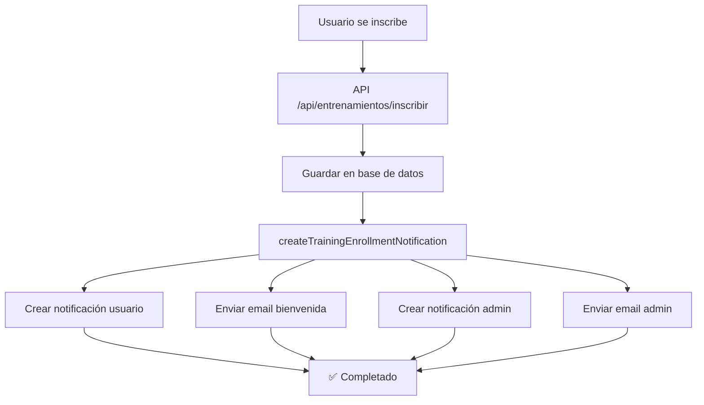
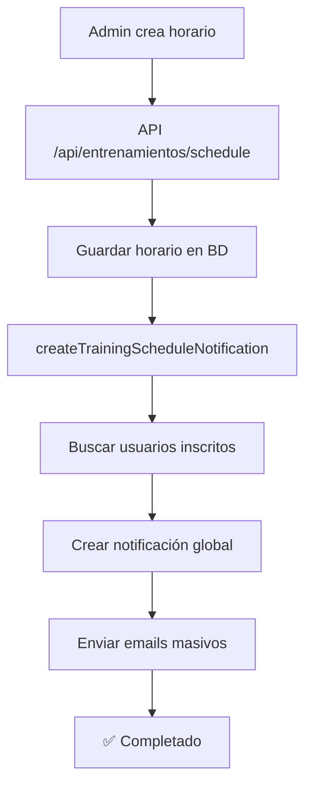

# 🎓 Sistema de Notificaciones de Entrenamientos

## 📋 Resumen

El sistema de notificaciones de entrenamientos automatiza la comunicación entre usuarios, administradores y el sistema cuando ocurren eventos importantes relacionados con los entrenamientos de trading.

## 🔧 Componentes del Sistema

### 1. **Archivo Principal: `lib/trainingNotifications.ts`**

Contiene todas las funciones principales del sistema:

- `createTrainingEnrollmentNotification()` - Notificaciones de inscripción
- `createTrainingScheduleNotification()` - Notificaciones de nuevos horarios
- Templates de email personalizados

### 2. **Endpoints Integrados**

- `pages/api/entrenamientos/inscribir.ts` - Se activa al inscribirse
- `pages/api/entrenamientos/schedule/index.ts` - Se activa al crear horarios

### 3. **Sistema de Pruebas**

- `pages/api/admin/test-training-notifications.ts` - Endpoint de prueba
- `pages/admin/test-training-notifications.tsx` - Interfaz de administración

## 🚀 Funcionalidades

### ✅ Notificaciones de Inscripción

**Cuándo se activa:** Cuando un usuario se inscribe a un entrenamiento

**Qué se crea:**
1. **Notificación para el usuario** - Bienvenida y confirmación
2. **Email de bienvenida** - Template personalizado con detalles
3. **Notificación para el admin** - Información del nuevo estudiante
4. **Email al admin** - Detalles completos de la inscripción

**Contenido de las notificaciones:**
- Nombre del entrenamiento
- Precio pagado
- Fecha de inscripción
- Enlaces de acción (comenzar entrenamiento, ver usuario)

### ✅ Notificaciones de Nuevos Horarios

**Cuándo se activa:** Cuando el admin crea un nuevo horario de entrenamiento

**Qué se crea:**
1. **Notificación global** - Para todos los usuarios inscritos
2. **Emails masivos** - A todos los usuarios inscritos en ese entrenamiento
3. **Detalles del horario** - Día, hora, duración, precio

**Contenido de las notificaciones:**
- Detalles del nuevo horario
- Enlaces para reservar
- Consejos para aprovechar la clase

## 📧 Templates de Email

### 🎓 Email de Bienvenida al Entrenamiento

**Características:**
- Diseño profesional con gradientes rojos
- Información detallada de la inscripción
- Sección "¿Qué puedes hacer ahora?"
- Enlaces de acción directos
- Información de contacto

**Elementos incluidos:**
- ✅ Confirmación de inscripción
- ✅ Detalles del entrenamiento
- ✅ Precio pagado
- ✅ Enlaces para comenzar
- ✅ Información de soporte

### 👤 Email de Notificación al Admin

**Características:**
- Diseño azul profesional
- Información completa del estudiante
- Acciones recomendadas
- Enlace directo al panel de usuarios

**Elementos incluidos:**
- ✅ Datos del estudiante
- ✅ Información del entrenamiento
- ✅ Fecha y hora de inscripción
- ✅ Acciones recomendadas

### 📅 Email de Nuevo Horario

**Características:**
- Diseño verde para horarios
- Detalles completos del horario
- Call-to-action para reservar
- Consejos para aprovechar la clase

**Elementos incluidos:**
- ✅ Detalles del horario
- ✅ Información de la clase
- ✅ Enlace para reservar
- ✅ Consejos prácticos

## 🧪 Sistema de Pruebas

### Endpoint de Prueba: `/api/admin/test-training-notifications`

**Métodos disponibles:**
- `POST` con `testType: 'enrollment'` - Prueba notificaciones de inscripción
- `POST` con `testType: 'schedule'` - Prueba notificaciones de horarios

**Parámetros opcionales:**
- `userEmail` - Email personalizado para la prueba
- `userName` - Nombre personalizado para la prueba

### Interfaz de Administración: `/admin/test-training-notifications`

**Características:**
- ✅ Interfaz intuitiva para administradores
- ✅ Configuración de datos de prueba
- ✅ Resultados en tiempo real
- ✅ Información detallada de cada prueba
- ✅ Guías y consejos

## 🔧 Configuración Requerida

### Variables de Entorno

```env
# Email del administrador
ADMIN_EMAIL=admin@nahuellozano.com

# Configuración SMTP
SMTP_USER=contacto@nahuellozano.com
SMTP_PASS=tu_password_smtp
SMTP_HOST=smtp.gmail.com
SMTP_PORT=587

# URL base del sitio
NEXT_PUBLIC_BASE_URL=https://nahuellozano.com
```

### Base de Datos

**Modelos requeridos:**
- `Notification` - Para almacenar notificaciones
- `User` - Para usuarios y sus entrenamientos
- `Training` - Para información de entrenamientos

## 📊 Flujo de Funcionamiento

### 1. Inscripción a Entrenamiento



### 2. Creación de Nuevo Horario



## 🛠️ Mantenimiento y Monitoreo

### Logs del Sistema

El sistema genera logs detallados para monitoreo:

```javascript
// Ejemplo de logs
console.log('🎓 [TRAINING ENROLLMENT] Creando notificación de inscripción:', {
  userEmail,
  trainingType,
  trainingName,
  price
});

console.log('✅ [TRAINING ENROLLMENT] Notificación de usuario creada:', notificationId);
console.log('✅ [TRAINING ENROLLMENT] Email de bienvenida enviado a:', userEmail);
```

### Métricas Importantes

- **Tasa de entrega de emails** - Monitorear fallos de SMTP
- **Usuarios notificados** - Contar notificaciones creadas
- **Tiempo de respuesta** - Velocidad del sistema
- **Errores** - Capturar y resolver problemas

## 🔍 Solución de Problemas

### Problemas Comunes

1. **Emails no se envían**
   - Verificar configuración SMTP
   - Revisar logs de error
   - Comprobar variables de entorno

2. **Notificaciones no aparecen**
   - Verificar conexión a MongoDB
   - Revisar permisos de usuario
   - Comprobar targetUsers en notificaciones

3. **Errores en pruebas**
   - Verificar permisos de admin
   - Revisar logs del endpoint
   - Comprobar datos de prueba

### Comandos de Diagnóstico

```bash
# Verificar configuración SMTP
curl -X POST /api/admin/test-training-notifications \
  -H "Content-Type: application/json" \
  -d '{"testType": "enrollment"}'

# Verificar notificaciones en BD
db.notifications.find({isAutomatic: true}).sort({createdAt: -1}).limit(10)
```

## 🚀 Próximas Mejoras

### Funcionalidades Planificadas

1. **Notificaciones Push** - Para navegadores móviles
2. **Plantillas Personalizables** - Editor de templates
3. **Programación de Notificaciones** - Envío diferido
4. **Analytics Avanzados** - Métricas detalladas
5. **Integración con WhatsApp** - Notificaciones por WhatsApp

### Optimizaciones Técnicas

1. **Queue System** - Para emails masivos
2. **Caching** - Para mejorar rendimiento
3. **Rate Limiting** - Para prevenir spam
4. **A/B Testing** - Para optimizar templates

## 📞 Soporte

Para problemas o consultas sobre el sistema de notificaciones:

- **Email:** admin@nahuellozano.com
- **Documentación:** Este archivo
- **Logs:** Revisar console.log en producción
- **Pruebas:** Usar `/admin/test-training-notifications`

---

**Última actualización:** Diciembre 2024  
**Versión:** 1.0.0  
**Mantenido por:** Equipo de Desarrollo 